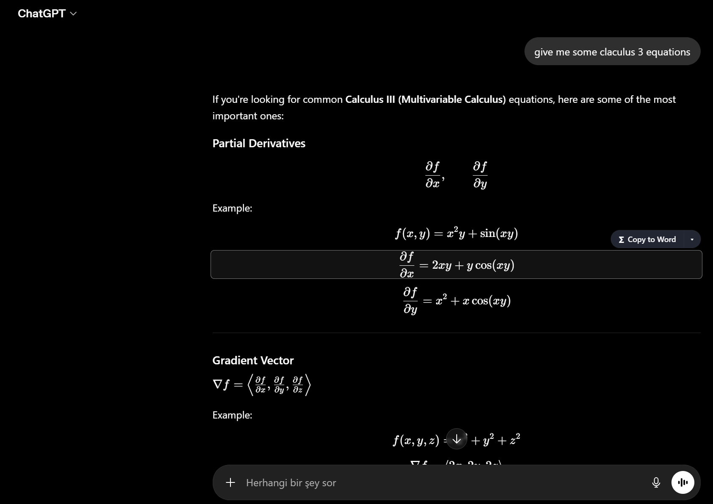
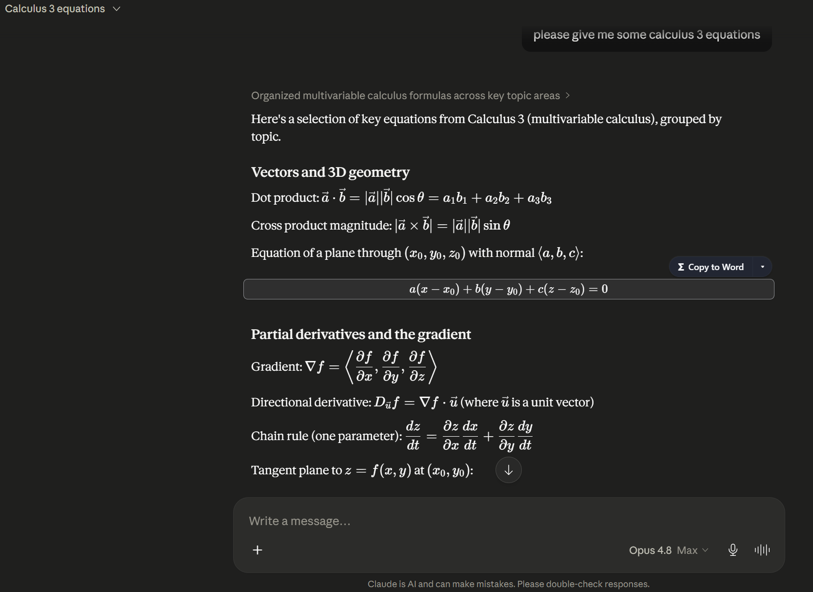
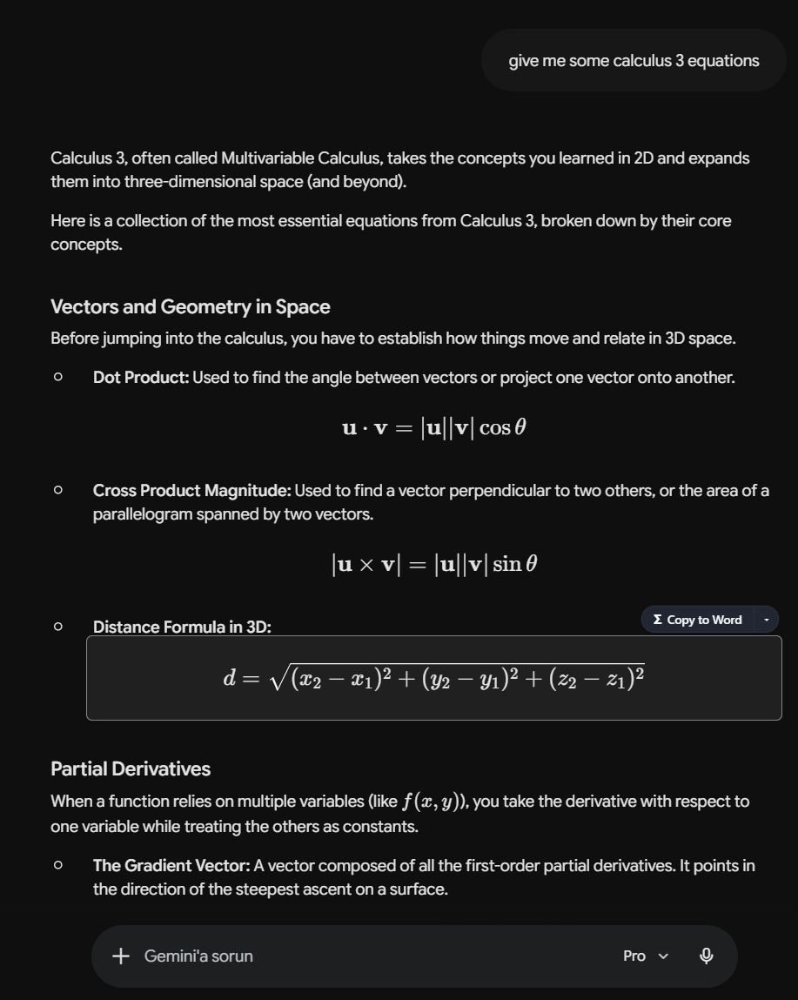
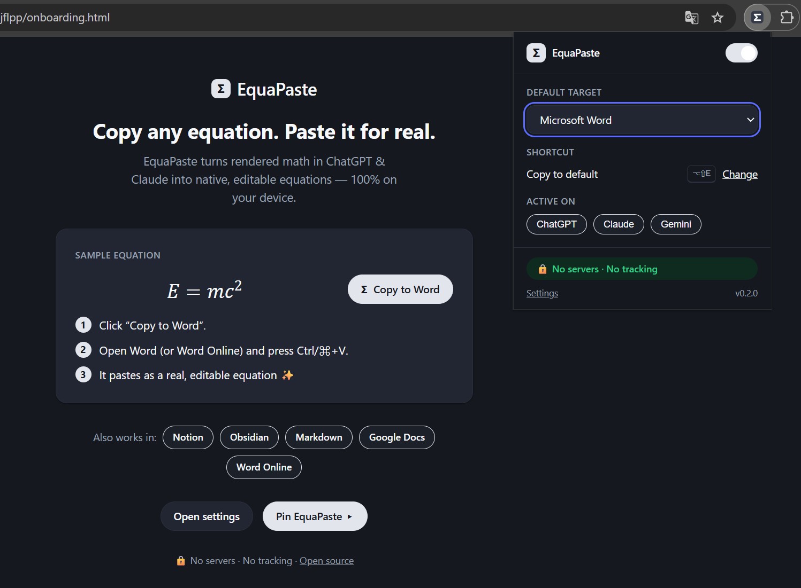

<div align="center">

# Σ EquaPaste

**Copy the math from ChatGPT, Claude, Gemini, Perplexity & DeepSeek — paste it as a _real, editable_ equation.**

🔒 **No servers · No tracking · Open source** — everything runs in your browser.

</div>

---

AI chats render beautiful math, but the moment you paste it into Word it turns into
broken raw LaTeX. EquaPaste fixes that loop: hover any equation, click once, and it
lands in your document as a **native, editable equation** — not a screenshot, not source code.

<p align="center">
  
  <br>
  <em>Hover any equation in ChatGPT — the whole block highlights and a <strong>Σ Copy to Word</strong> pill appears.</em>
</p>

## How it works

1. Hover (or focus) an equation in ChatGPT, Claude, Gemini, Perplexity or DeepSeek — the whole block highlights and a **Copy** pill appears.
2. Click anywhere on the equation, or the pill, to copy to your default target (Word by default).
3. Paste. Use the **▾** menu to pick a different format or target.

No setup, no account, no network calls. The LaTeX → MathML → OMML conversion happens
entirely on your device.

## Screenshots

The same one-click copy works across every supported chat:

<table>
  <tr>
    <td width="50%" valign="top" align="center">
      
      <br><sub><strong>Claude</strong></sub>
    </td>
    <td width="50%" valign="top" align="center">
      
      <br><sub><strong>Gemini</strong></sub>
    </td>
  </tr>
</table>

The first-run onboarding and the toolbar popup — pick a default target, see which chats
are active, and confirm everything stays on your device:

<p align="center">
  
</p>

## Supported targets

| Target | Result | Reliability |
|---|---|---|
| **Microsoft Word** (desktop) | Native, editable equation | High |
| **Notion** | Native math block (type `/math`, then paste) | Good |
| **Obsidian / Markdown** (GitHub, GitLab) | `$…$` / `$$…$$`, renders natively | High |
| **LaTeX / MathML** | Raw source | High |
| **Word Online** | Best-effort (LaTeX fallback / open in desktop) | Limited |
| **Google Docs** | Image **with the LaTeX in alt text** — native equations aren't possible via clipboard | Limited |

> **Honest note on Google Docs:** Google Docs cannot accept a native equation from the
> clipboard — there is no API for it. EquaPaste pastes a crisp image and stores the source
> LaTeX in the image's alt text so it stays recoverable. We will never claim otherwise.

Input platforms in this release: **ChatGPT**, **Claude**, **Gemini**, **Perplexity** and
**DeepSeek**. Microsoft Copilot and more are planned.

## Install

**From a store:** _coming soon_ (Chrome Web Store, then Edge Add-ons & Firefox AMO).

**From source (development):**

```bash
pnpm install
pnpm dev            # launches Chrome with hot-reload
# or build an unpacked extension:
pnpm build          # outputs .output/chrome-mv3
```

Then load `.output/chrome-mv3` via `chrome://extensions` → *Load unpacked*.

## Privacy

EquaPaste collects **nothing**. No analytics, no telemetry, no account, no external
requests. It only reads the rendered equation under your cursor on supported pages and
writes to your clipboard when you click. See [PRIVACY.md](PRIVACY.md).

## Tech

TypeScript · [WXT](https://wxt.dev) (Manifest V3) · [Temml](https://temml.org) for
LaTeX → MathML · a clean-room MIT MathML → OMML converter · shadow-DOM UI · Vitest + Playwright.

How Word receives a native equation (bare Presentation MathML on the clipboard) is
documented in [docs/word-clipboard-findings.md](docs/word-clipboard-findings.md).

## Contributing

See [CONTRIBUTING.md](CONTRIBUTING.md). Issues and PRs welcome.

## Author

Made by **Halil İbrahim Yesirci** — [@halilibrahimyesirci](https://github.com/halilibrahimyesirci).

## License

[MIT](LICENSE) © 2026 Halil İbrahim Yesirci.
